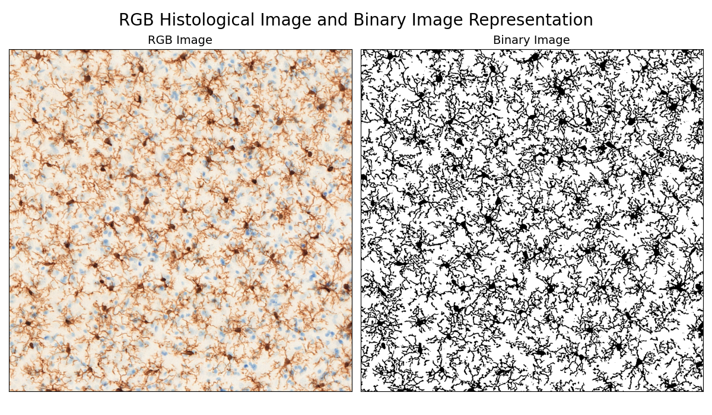
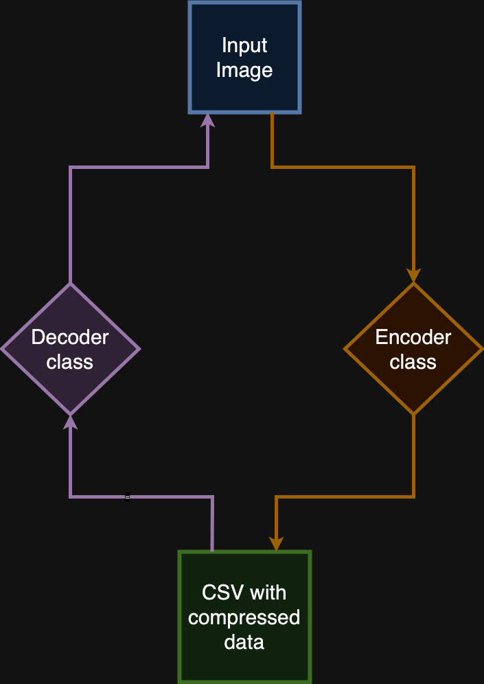
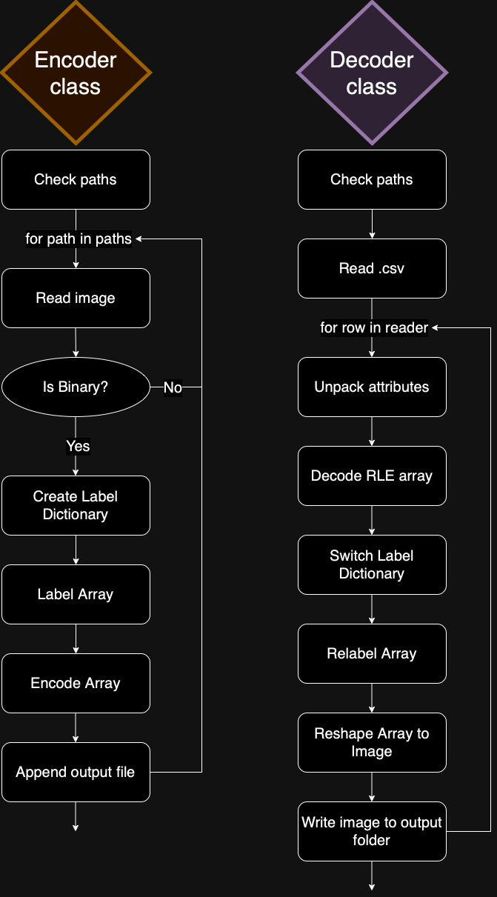
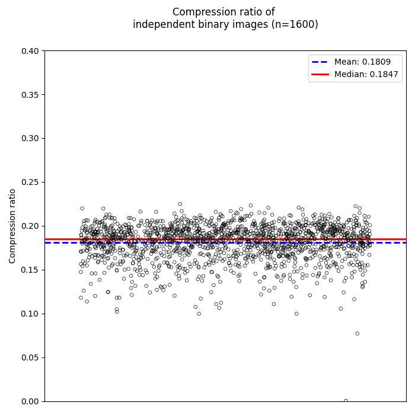
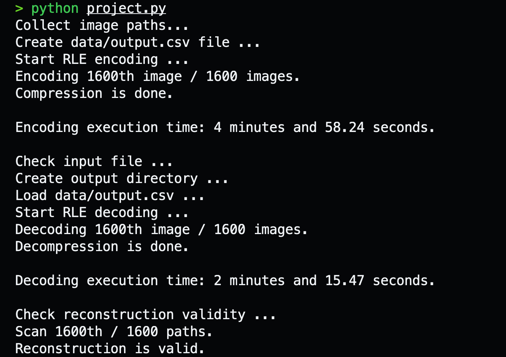

# Run-Length Encoding (RLE) of Binary Images

#### Video Demo:  <URL HERE>
#### Author: Balint Fazekas
#### Date: 2024.09.25.

## Description
### Understanding binary images
A binary image is a digital image that consists of only two possible pixel values, typically 0 and 1, representing black and white (or any other two colors). 
Each pixel in a binary image indicates a region of interest or background, making it a useful format for applications requiring clear distinctions between objects and backgrounds, such as semantic segmentation, object recognition, and image thresholding.

<div style="text_align: center;">
    <br>
    <sub>
    Figure 1: RGB histological image of IBA-1 stained microglial cells (resident immune cells of the brain) and a representative binary mask. Note, the binary image represents only the positively stained pixels with brown chromogen, significantly reducing data dimensionality and simplifying downstream analysis.
    </sub>
    <br><br>
</div>

Binary images are usually represented in a single 8-bit channel.
This represents a significant reduction in data size compared to 24-bit, 3-channel RGB images.
Due to their inherent simplicity, binary images also provide opportunities for further data compression.
This final project aims to develop a straightforward Run-Length Encoding method for achieving substantial data compression of binary images using Python.
<br><br>

### Understanding Run-Length Encodeing
Run-Length Encoding (RLE) is a simple and efficient form of data compression, particularly effective for binary images. It works by reducing sequences of repeated values into a single count and value.
For example, instead of storing a series of pixels like 'bbbbwwww', RLE would encode it as '4w4b', resulting in a compact representation of 4 'b' followed by 4 'w'.
This method significantly reduces the amount of data stored, especially in images with large areas of uniform color. RLE is easy to implement and requires minimal processing power, making it suitable for real-time applications.
However, its efficiency diminishes with more complex images containing frequent color changes, where the overhead of storing counts may exceed the benefits of compression.
Overall, RLE is a valuable technique for specific use cases, particularly in scenarios with repetitive data.
<br><br>
The classic implementation of RLE would encode the sequence 'wbwb' as '1w1b1w1b'. This results in an 8-byte encoding from an originally 4-byte sequence. In this RLE implementation, sequences with repetitions of 2 or fewer are left unchanged, ensuring that encoding occurs only when it provides meaningful compression.
<br><br>

### High-Level Overview of the Program's Logic
<p> Used functions and classes implemented in 'project.py'. <p> 

<p> The user could initialise a 'Encoder' class with given 'input_folder' of binary images, 'output_path' as desired path of output '.csv' file and 'image_suffix' as extension of images of interest. After initialisation 'Encoder.forward()' execute the compression automatically.</p> 
'Encoder' class create a '.csv' file wiht the following columns:

- image name as 'Image' (str),
- image shape as 'Shape' (tuple saved as str),
- labels as 'Labels' (dictionary saved as str),
- encoded image as 'RLE (str)

<p>Alternativelly, the user could initialise a 'Decoder' class with given 'input_file' of .csv file created by a 'Encoder', 'output_folder' as desired path of output reconstructed binary files and 'image_suffix' as extension of images of interest. After initialisation 'Decoder.forward()' execute the decompression automatically.</p>

<div style="text-align: center;">
    

<br>
<sub>Figure 2.: High overview of operation logic.</sub>
</div>
<br><br>

### High-overview of Task-specific classes operation
#### Encoder class
'Encoder' class execute the following steps:
- check extension of given 'output_csv' path. Raise 'ValueError', if defined output path is not in '.csv' extension.
- collecting individual paths of given 'input_folder' and 'image_suffix'.
- create output '.csv'.
- For 'path' in 'paths':
  - read individual image.
  - check image has exactly two unique values. If not 'continue' execution loop. Else:
  - get image shape.
  - reshape image into 1-D array.
  - create label dictionary.
  - convert numeric arrays into alphabetical characters.
  - encode array.
  - write row to output file.

If 'log_excluded' defined as 'True', non-binary image names are listed into 'excluded.txt'.

#### Decoder class
'Decoder' class execute the following steps:
- check 'input_file' extension, create output folder if not exists.
- read input file with 'DictReader' as 'reader'.
- for 'row' in 'reader':
  - unpack and eval attributes.
  - decode 'RLE' string.
  - switched key-value pairs in 'Labels' dictionary.
  - relabel array with switched dictionary.
  - reshape array to image.
  - write out reconstructed mask.
<br><br>

<div style="text-align: center;">
    
    <br>
<sub>Figure 3.: High overview of task-specific classes's operation logic.</sub>
</div>
<br><br>

For additional details, please refer to the docstring of the relevant functions in the project.py file.
<br><br>

### Compression ratio

The expected compression ratio is significantly influenced by the variation in pixel value frequency. To estimate the average compression ratio, I ran the encoder on 1,600 binary images, each sized 512 x 512 pixels, similar to the example above. For this RLE implementation, the expected compression ratio is approximately 0.2.

Note that the compression ratio may vary for different types of binary images.

<div style="text-align: center;">
    
    <br>
<sub>Figure 4.: Compression ratio of independent binary images (n=1600).</sub>

</div>
<br><br>

Encoding and decoding of this experiment take a couple of minutes for each. The original and decoded images were identical.

<div style="text-align: center;">
    
    <br>
<sub>Figure 5.: Required execution times and pixel-wise validation of reconstructed masks.</sub>

</div>
<br><br>

### Should you use this compression method?

Probably not. 
While it was enjoyable to implement RLE compression, it's probably not the best choice.
There are faster and more efficient compression methods that significantly outperform this implementation, both in terms of compression ratio and execution speed.
Therefore, it may be advisable to explore alternative (built-in) solutions for optimal performance.
<br><br>

### Installation

The program is implemented in Python in version 3.11.

If you have existing 'conda' installation (recommended) execute this line in terminal:

```
conda env create -f rle.yml
```

Alternatively install dependencies via 'pip':
```
pip install -r requirements.txt
```